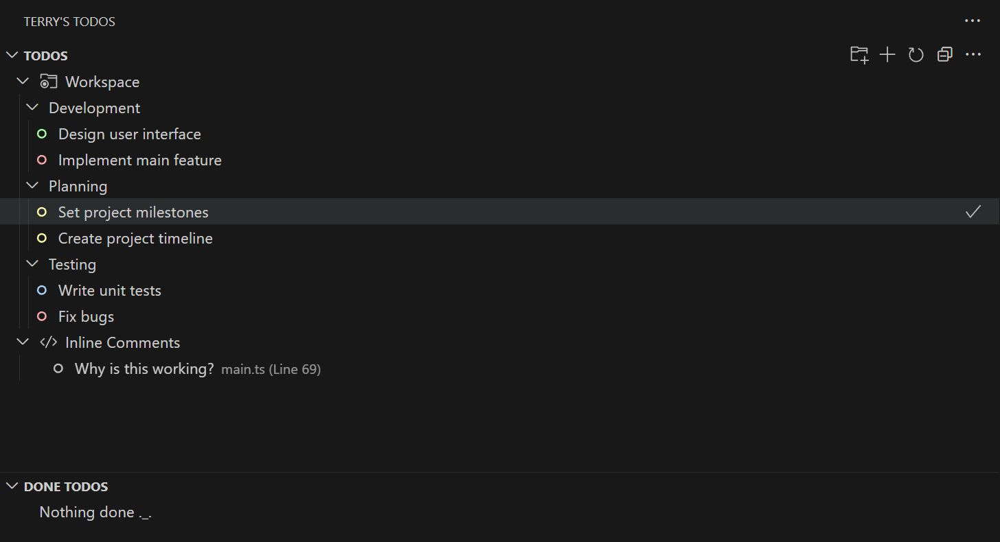
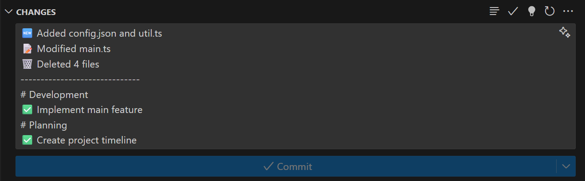

# Terry's Todos README

Terry's Todos is a simple extension designed to help you to keep track of your todos 📝.\
The extension is meant to be a todo manager for one specific workspace. Therefore, each of your projects has its own todo list to boost your productivity 📈.

➕ _NEW_ ➕\
**Automatic detection of inline todo comments (e.g. '// TODO: Rate this extension')!** 💡

To learn more about Terry's Tools [visit my marketplace page](https://marketplace.visualstudio.com/publishers/terrys-tools).

## Features ✨

-   Create a new todo (ctrl + alt + T)

-   Manage existing todos in the side panel

    -   Create folders
    -   Highlight todos in different colors
    -   Sort todos by date or color
    -   Use Drag and Drop features

- Benefit from automatic inline todo detection to avoid losing track of tasks

###

###

-   Automatic generation of commit messages based on the changes made in the workspace and the todos marked as done. Simply press the 💡 icon on the top right of the source control side panel

###

###

**Enjoy!** 👏
